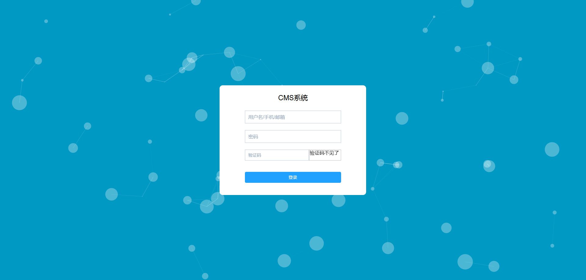
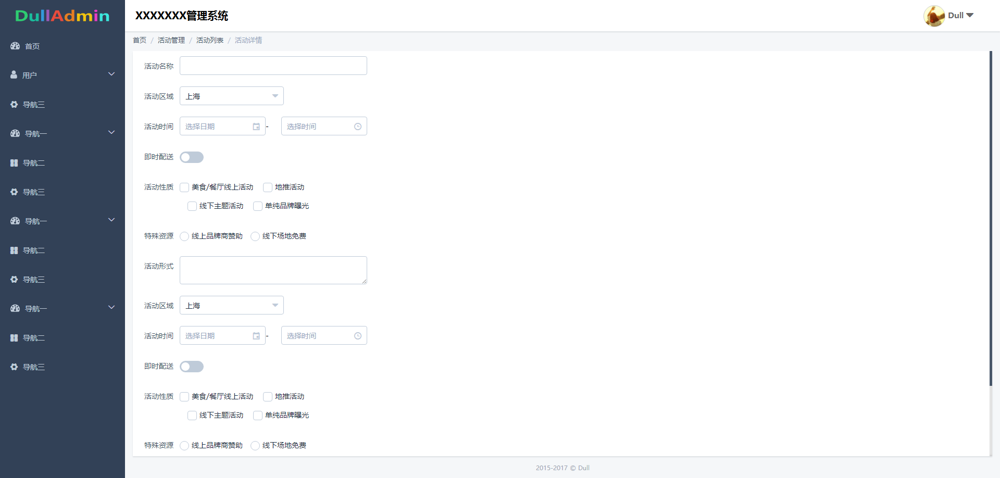

# backend

> 基于Vue.js和ElementUI的后端管理系统

## demo
[http://cms.edaoe.com](http://cms.edaoe.com/) （没有账号、密码，可以直接登录）





## Build Setup

``` bash
# install dependencies
npm install

# serve with hot reload at localhost:8080
npm run dev

# build for production with minification
npm run build

# build for production and view the bundle analyzer report
npm run build --report
```
